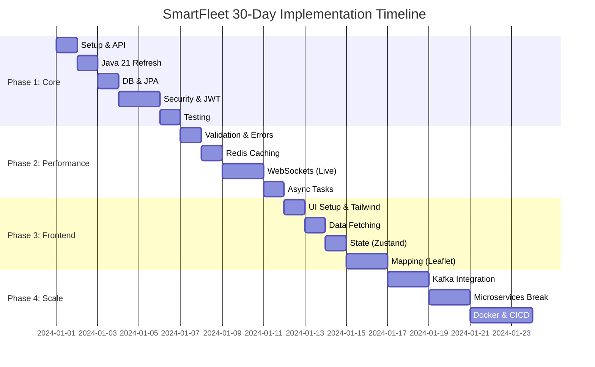

# SmartFleet: Real-Time Logistics & Asset Tracking

Welcome to **SmartFleet**, a comprehensive project designed to demonstrate full-stack proficiency with modern Java and interactive frontend technologies. This roadmap is structured to bridge the gap between intermediate and senior developer levels (3-4 years experience).

---

## 🗺️ Project Roadmap

---

## 📑 Table of Contents
- [Phase 1: The Secure Core (Days 1–7)](#phase-1-the-secure-core-days-17)
- [Phase 2: Professional Backend (Days 8–14)](#phase-2-professional-backend-days-8-14)
- [Phase 3: Frontend Excellence (Days 15–22)](#phase-3-frontend-excellence-days-15-22)
- [Phase 4: Architecture & Scale (Days 23–30)](#phase-4-architecture--scale-days-23-30)

---

## Phase 1: The Secure Core (Days 1–7)
**Goal:** Master Java 21 basics and build a secure monolithic backend.

### 📅 Daily breakdown
- [x] **Day 1: Setup & Your First Spring Boot API**
    - Install JDK 21, IntelliJ, Postman.
    - Generate project at [start.spring.io](https://start.spring.io).
- [ ] **Day 2: Java 21 Core Refresh**
    - Practice Streams (filter, map, collect).
    - Use Java **Records** for DTOs.
- [ ] **Day 3: Persistence with PostgreSQL & JPA**
    - Configure `application.properties`.
    - Implement `VehicleRepository`.
- [ ] **Day 4: Spring Security Basics**
    - Implement `SecurityFilterChain`.
- [ ] **Day 5: JWT Authentication**
    - Issue tokens for secure login.
- [ ] **Day 6: Relationships (One-to-Many)**
    - Link `Vehicle` to `ServiceRecord`.
- [ ] **Day 7: Testing with Mockito**
    - Unit test services with mocks.

> [!IMPORTANT]
> **Interview Tip:** Be ready to explain why you chose Java 21 (Virtual Threads, Records, Sealed Classes) and how JWT improves scalability over session-based auth.

---

## Phase 2: Professional Backend (Days 8–14)
**Goal:** Production-grade features like caching, validation, and async tasks.

- [ ] **Day 8: Validation & Error Handling**
    - Use `@RestControllerAdvice`.
- [ ] **Day 9: Redis for Performance**
    - Add `@Cacheable` to optimize performance.
- [ ] **Day 10: Spring Profiles**
    - Manage `application-dev.yml` vs `application-prod.yml`.
- [ ] **Day 11-12: Real-time with WebSockets**
    - Live location broadcasting.
- [ ] **Day 13: Async Tasks (`@Async`)**
    - Offload heavy tasks like PDF generation.
- [ ] **Day 14: Swagger/OpenAPI**
    - Document the API layer.

---

## Phase 3: Frontend Excellence (Days 15–22)
**Goal:** Build a modern, interactive dashboard using React & Tailwind.

- [ ] **Day 15: React & Tailwind Setup**
- [ ] **Day 16: Data Fetching (Axios)**
- [ ] **Day 17: Auth Integration**
    - Store JWT in `localStorage` or `HttpOnly` cookies.
- [ ] **Day 18: State Management (Zustand)**
- [ ] **Day 19: Forms (React Hook Form)**
- [ ] **Day 20: UI/UX (Lucide Icons & Cards)**
- [ ] **Day 21-22: Mapping (Leaflet.js)**
    - Visualize moving markers in real-time.

> [!TIP]
> Using **Zustand** instead of Redux shows that you keep up with modern React trends (simpler API, better performance).

---

## Phase 4: Architecture & Scale (Days 23–30)
**Goal:** Event-driven systems and Microservices.

- [] **Day 23-24: Apache Kafka**
    - Decouple tracking updates from the main flow.
- [ ] **Day 25-27: Microservices Transition**
    - Use **Spring Cloud Gateway** and **Feign Clients**.
- [ ] **Day 28: Dockerizing the Stack**
    - Orchestrate everything with `docker-compose`.
- [ ] **Day 29: CI/CD (GitHub Actions)**
- [ ] **Day 30: Final Polish & Demo**

---

### Why this project stands out?
1. **Concurrency:** Kafka handles high-frequency location data.
2. **Security:** JWT with modern best practices.
3. **Scalability:** Transitioning from monolith to microservices.
4. **Visibility:** A real-time map dashboard is a huge "wow" factor for demos.
